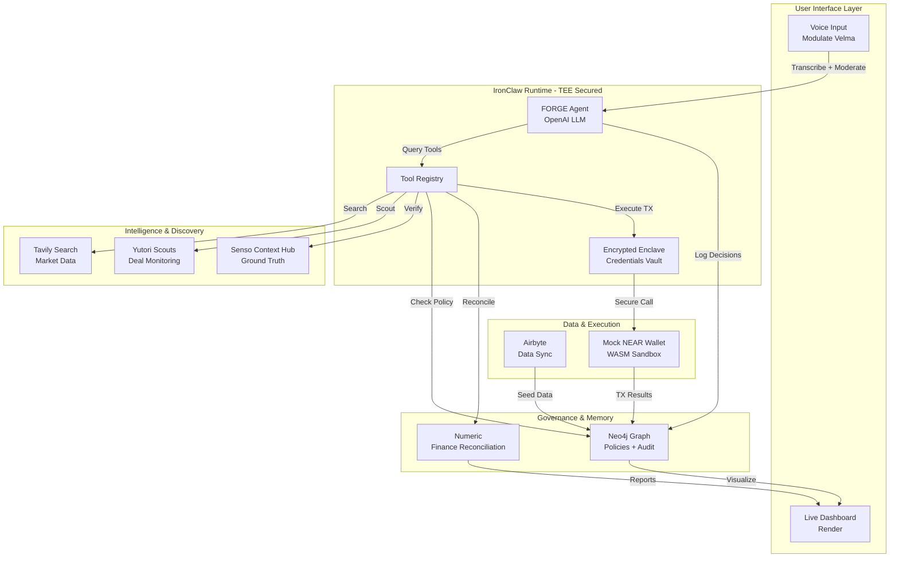
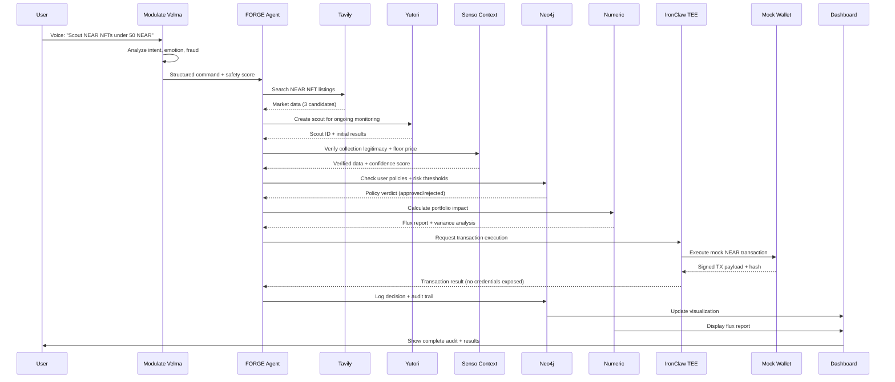
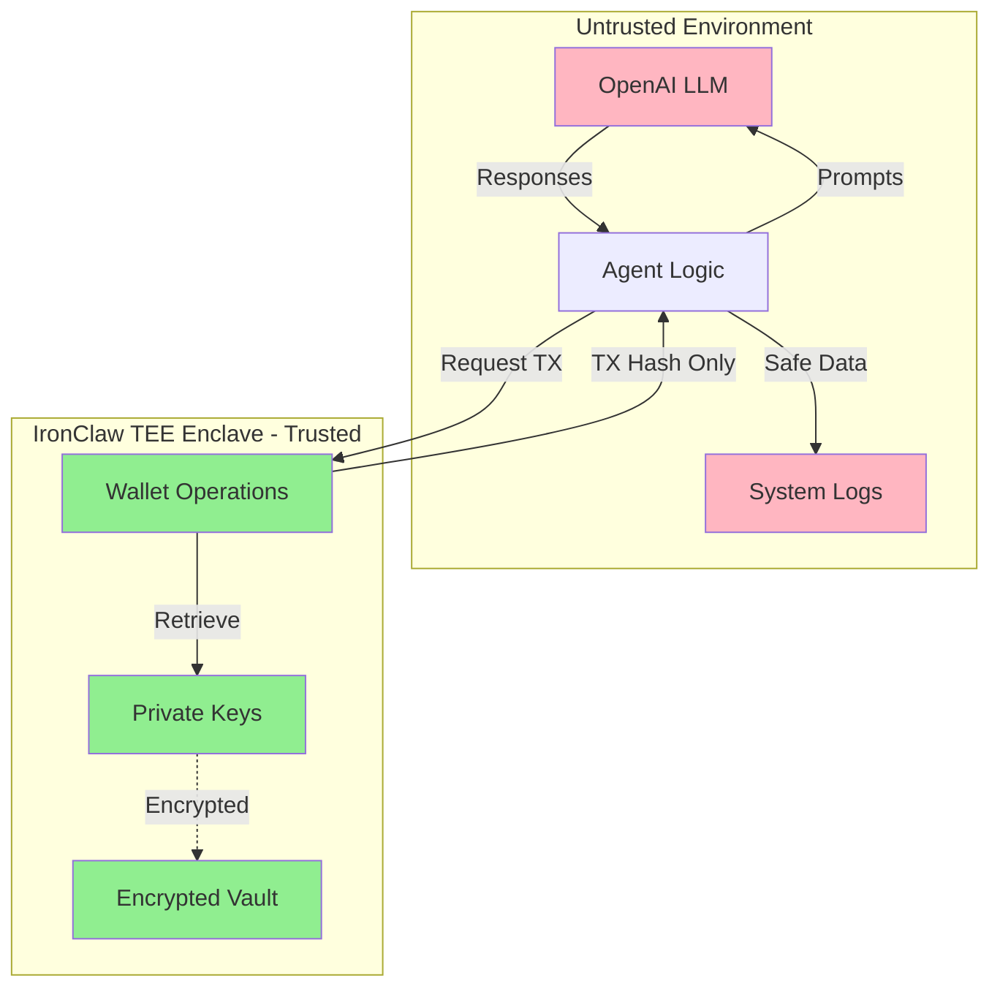
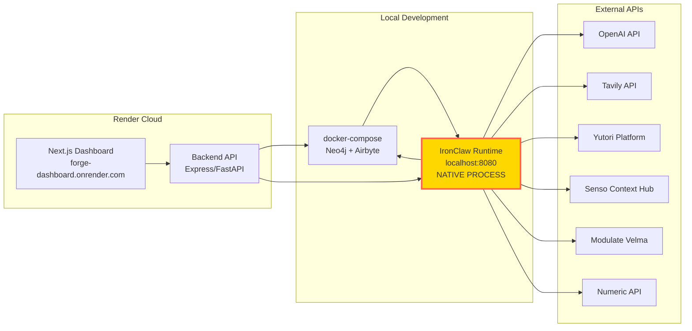

# FORGE Architecture Documentation

## Table of Contents

1. [Overview](#overview)
2. [High-Level Architecture](#high-level-architecture)
3. [Component Architecture](#component-architecture)
4. [Data Flow](#data-flow)
5. [TEE Security Architecture](#tee-security-architecture)
6. [Integration Architecture](#integration-architecture)
7. [Deployment Architecture](#deployment-architecture)
8. [Data Models](#data-models)

## Overview

FORGE (Forged On-chain Regulated Governance Engine) is a proof-of-concept autonomous AI agent platform that demonstrates secure, governed agentic commerce. The system integrates 9 sponsor technologies into a cohesive platform that prioritizes:

- **Security**: TEE-secured credential management via IronClaw
- **Governance**: Graph-based policy enforcement and audit trails via Neo4j
- **Verifiability**: Ground-truth context verification via Senso
- **Transparency**: Complete audit trail with financial reconciliation via Numeric
- **Usability**: Voice-first interface via Modulate and live dashboard via Render

### Key Design Principles

1. **Security First**: Private keys never exposed to LLM context
2. **Fail-Safe Governance**: All transactions must pass policy checks
3. **Complete Auditability**: Immutable append-only audit trail
4. **Graceful Degradation**: Mock fallbacks when APIs unavailable
5. **Real-Time Visibility**: Live dashboard shows all agent activity

## High-Level Architecture



### System Layers

1. **User Interface Layer**: Voice input and web dashboard
2. **Agent Runtime Layer**: IronClaw-hosted FORGE agent with OpenAI reasoning
3. **Intelligence Layer**: Discovery (Tavily, Yutori) and verification (Senso)
4. **Governance Layer**: Policy enforcement and audit trails (Neo4j)
5. **Finance Layer**: Reconciliation and reporting (Numeric)
6. **Execution Layer**: TEE-secured transaction execution

## Component Architecture

### 1. Voice Interface (Modulate Velma)

**Purpose**: Transcribe voice input, analyze intent/emotion, detect fraud risk

**Responsibilities**:
- Audio transcription to text
- Intent extraction (action, asset type, price limit, risk preference)
- Emotion analysis (confidence, urgency)
- Fraud risk scoring (0.0-1.0)
- Safety moderation (reject if fraud score > 0.7)

**Interface**:
```typescript
interface VoiceCommand {
  audio: Buffer | File;
  userId: string;
}

interface VoiceAnalysisResult {
  transcript: string;
  intent: {
    action: 'scout' | 'buy' | 'sell' | 'query';
    assetType: 'nft' | 'token' | 'any';
    priceLimit?: number;
    riskPreference: 'low' | 'medium' | 'high';
  };
  emotion: {
    confidence: number;
    urgency: number;
  };
  fraudScore: number;
  approved: boolean;
  timestamp: string;
}
```

**Fallback Strategy**: OpenAI Whisper for transcription + mock fraud scores

### 2. FORGE Agent (IronClaw Runtime)

**Purpose**: Orchestrate workflow, reason about decisions, call tools

**Responsibilities**:
- Receive and parse voice commands
- Plan multi-step workflows
- Call tools in dependency order
- Make decisions based on policy checks
- Log all actions to audit trail
- Handle errors gracefully

**Tool Registry**:
1. `tavily_search` - Market research and price discovery
2. `yutori_create_scout` - Set up ongoing monitoring
3. `senso_verify_context` - Ground-truth validation
4. `neo4j_check_policy` - Policy compliance verification
5. `numeric_reconcile` - Financial impact analysis
6. `mock_wallet_execute` - Secure transaction execution

**Configuration**:
```typescript
interface AgentConfig {
  llm: {
    provider: 'openai';
    model: 'gpt-4o';
    temperature: 0.7;
  };
  tools: Tool[];
  memory: {
    type: 'neo4j';
    connectionString: string;
  };
  security: {
    teeEnabled: boolean;
    credentialVault: string;
  };
}
```

### 3. Scout Engine (Tavily + Yutori)

**Purpose**: Discover deals, monitor markets, track price changes

**Tavily Integration**:
- Real-time web search for NFT listings
- Market data aggregation
- Price discovery
- Source URL collection

**Yutori Integration**:
- Create persistent scouts for ongoing monitoring
- Alert on price changes
- Track market trends
- Aggregate findings

**Fallback Strategy**: Mock deal data from JSON fixtures

### 4. Context Verifier (Senso Context Hub)

**Purpose**: Validate deal information against trusted sources

**Responsibilities**:
- Verify collection legitimacy
- Validate floor prices
- Check seller reputation
- Calculate confidence scores
- Flag high-risk deals (>15% price deviation)
- Cite source URLs

**Interface**:
```typescript
interface SensoVerificationResult {
  verified: boolean;
  confidenceScore: number; // 0.0 - 1.0
  checks: {
    collectionLegitimate: boolean;
    floorPriceAccurate: boolean;
    sellerReputable: boolean;
  };
  groundTruth: {
    actualFloorPrice?: number;
    priceDeviation?: number;
  };
  sources: Array<{
    url: string;
    authority: string;
    timestamp: string;
  }>;
  riskLevel: 'low' | 'medium' | 'high';
}
```

**Fallback Strategy**: Hardcoded floor prices for demo collections

### 5. Governance Graph (Neo4j)

**Purpose**: Store policies, relationships, audit trails; enforce compliance

**Responsibilities**:
- Store user-defined policies
- Check transactions against policies
- Create decision nodes with provenance
- Maintain immutable audit trail
- Support Cypher queries for analysis

**Graph Schema**:
```
User → HAS_POLICY → Policy
User → MADE_DECISION → Decision
Decision → CHECKED_POLICY → Policy
Decision → USED_CONTEXT → Context
Decision → TRIGGERED_TX → Transaction
Transaction → RECONCILED_BY → FluxReport
```

**Key Queries**:
```cypher
// Check user policies
MATCH (u:User {id: $userId})-[:HAS_POLICY]->(p:Policy)
WHERE p.active = true
RETURN p

// Log decision with provenance
CREATE (d:Decision {
  id: $decisionId,
  timestamp: datetime(),
  verdict: $verdict
})
WITH d
MATCH (u:User {id: $userId})
CREATE (u)-[:MADE_DECISION]->(d)

// Query audit trail
MATCH (u:User)-[:MADE_DECISION]->(d:Decision)-[:CHECKED_POLICY]->(p:Policy)
WHERE d.timestamp > datetime($startDate)
RETURN u, d, p
ORDER BY d.timestamp DESC
```

### 6. Finance Reconciler (Numeric)

**Purpose**: Calculate portfolio impact, generate variance reports

**Responsibilities**:
- Calculate portfolio value changes
- Generate Flux Reports with AI explanations
- Detect anomalies (variance > 5%)
- Provide natural language summaries
- Store reconciliation data in Neo4j

**Interface**:
```typescript
interface FluxReport {
  portfolioAfter: {
    totalValue: number;
    assets: Record<string, number>;
  };
  variance: {
    expected: number;
    actual: number;
    deviation: number;
  };
  anomalies: Array<{
    type: 'price_spike' | 'unexpected_fee' | 'balance_mismatch';
    severity: 'low' | 'medium' | 'high';
    description: string;
  }>;
  aiExplanation: string;
  reconciled: boolean;
  timestamp: string;
}
```

**Fallback Strategy**: Local calculation + OpenAI-generated explanations

### 7. Mock NEAR Wallet (IronClaw TEE)

**Purpose**: Simulate NEAR transactions securely without exposing credentials

**Responsibilities**:
- Retrieve credentials from TEE vault (never logged)
- Generate mock transaction payloads
- Sign transactions in WASM sandbox
- Return transaction hashes
- Log TEE access without revealing values

**Security Guarantees**:
- Private keys stored in encrypted TEE enclave
- Keys never appear in LLM prompts/responses
- All access logged with "TEE: Credentials accessed"
- WASM sandbox isolation

**Interface**:
```typescript
interface WalletExecuteResult {
  success: boolean;
  transactionHash: string;
  signedPayload: {
    nonce: number;
    blockHash: string;
    actions: any[];
  };
  gasUsed: number;
  timestamp: string;
  credentialsExposed: false; // Always false
}
```

### 8. Data Sync (Airbyte)

**Purpose**: Seed initial data into Neo4j for demo

**Responsibilities**:
- Load demo users
- Seed policies (3 per user)
- Import NFT collection data
- Initialize portfolio state

**Fallback Strategy**: Direct Cypher script execution

### 9. Live Dashboard (Render)

**Purpose**: Visualize agent activity, governance graph, audit trail

**Components**:
- **AgentStatus**: Real-time workflow progress
- **GraphVisualization**: Interactive D3.js graph
- **AuditTrail**: Chronological decision list
- **FluxReport**: Financial reconciliation display
- **SponsorGrid**: Integration status indicators

**Technology Stack**:
- Next.js 14 (App Router)
- React 18
- D3.js (graph visualization)
- Tailwind CSS (styling)
- Server-Sent Events (real-time updates)

## Data Flow

### Complete Demo Flow Sequence



### Data Flow Characteristics

**Latency Targets**:
- Voice transcription: < 2 seconds
- Market search: < 3 seconds
- Context verification: < 2 seconds
- Policy check: < 1 second
- Transaction execution: < 500ms
- **Total end-to-end: < 15 seconds**

**Data Persistence**:
- All decisions → Neo4j (immutable)
- All tool outputs → Neo4j (as JSON properties)
- All transactions → Neo4j (with TEE access logs)
- Flux reports → Neo4j (linked to transactions)

## TEE Security Architecture

### Trusted Execution Environment Design



### Security Guarantees

**1. Credential Isolation**:
- Private keys stored in IronClaw encrypted vault
- Vault accessible only from WASM sandbox
- Keys never appear in:
  - LLM prompts or responses
  - Agent logs
  - Neo4j database
  - Dashboard UI
  - API responses

**2. Audit Trail Integrity**:
- All credential access logged with timestamp
- Logs contain "TEE: Credentials accessed" without values
- Neo4j audit trail is append-only
- Decision provenance includes TEE access events

**3. Secure Communication**:
- All external API calls over HTTPS
- Neo4j connections use Bolt protocol with auth
- Dashboard uses secure WebSocket for real-time updates

**4. Input Validation**:
- Voice commands validated before processing
- Transaction parameters validated against schema
- Policy thresholds validated as positive numbers
- All user inputs sanitized before Neo4j queries

### Threat Model

**Threats Mitigated**:
1. LLM Prompt Injection → Credentials never in context
2. Log Exposure → Keys never logged in plaintext
3. Database Breach → Keys not stored in Neo4j
4. API Interception → HTTPS for all external calls
5. Replay Attacks → Transaction nonces prevent replay

**Threats Out of Scope** (POC limitations):
1. Multi-user authentication
2. Rate limiting on APIs
3. DDoS protection
4. Physical security
5. Real blockchain security (mock wallet only)

## Integration Architecture

### Sponsor Integration Summary

| Sponsor | Purpose | Integration Type | Fallback Strategy |
|---------|---------|------------------|-------------------|
| IronClaw | Agent runtime + TEE | Core (required) | None - system dependency |
| OpenAI | LLM reasoning | API | None - system dependency |
| Tavily | Market search | REST API | Mock JSON responses |
| Yutori | Deal monitoring | REST API | Periodic Tavily calls |
| Senso | Context verification | REST API | Hardcoded floor prices |
| Neo4j | Graph database | Driver | None - system dependency |
| Modulate | Voice processing | REST API | Whisper + mock scores |
| Numeric | Finance reconciliation | REST API | Local calculation + GPT |
| Airbyte | Data sync | Docker | Direct Cypher scripts |
| Render | Dashboard hosting | Git deploy | Local dev server |

### Circuit Breaker Pattern

All external API calls use a circuit breaker with automatic fallback:

```typescript
class CircuitBreaker {
  private failures = 0;
  private lastFailureTime = 0;
  private state: 'closed' | 'open' | 'half-open' = 'closed';
  
  async execute<T>(fn: () => Promise<T>, fallback: () => T): Promise<T> {
    if (this.state === 'open') {
      if (Date.now() - this.lastFailureTime > 60000) {
        this.state = 'half-open';
      } else {
        return fallback();
      }
    }
    
    try {
      const result = await fn();
      this.failures = 0;
      this.state = 'closed';
      return result;
    } catch (error) {
      this.failures++;
      this.lastFailureTime = Date.now();
      if (this.failures >= 3) {
        this.state = 'open';
      }
      return fallback();
    }
  }
}
```

### Retry Strategy

```typescript
async function callWithRetry<T>(
  fn: () => Promise<T>,
  maxRetries: number = 3,
  baseDelay: number = 1000
): Promise<T> {
  for (let i = 0; i < maxRetries; i++) {
    try {
      return await fn();
    } catch (error) {
      if (i === maxRetries - 1) throw error;
      await sleep(baseDelay * Math.pow(2, i));
    }
  }
  throw new Error('Max retries exceeded');
}
```

## Deployment Architecture

### Important: IronClaw Deployment Model

**⚠️ Critical Understanding: IronClaw runs as a native process on your host machine, NOT in Docker.**

#### Why IronClaw Doesn't Run in Docker

IronClaw requires direct access to hardware TEE (Trusted Execution Environment) features:
- **Intel SGX** (Software Guard Extensions) on Intel processors
- **ARM TrustZone** on ARM processors

These hardware security features provide:
- Encrypted memory enclaves for credential storage
- Secure execution environments isolated from the OS
- Hardware-backed cryptographic operations

**Docker containers cannot access these features** because:
1. TEE requires direct CPU instruction access (ENCLU, EENTER, etc.)
2. Hardware enclaves need kernel-level integration
3. Virtualization layers break TEE security guarantees
4. Container isolation prevents hardware enclave access

#### What This Means for FORGE

**Deployment Model**:

**Docker Containers** (via `docker-compose.yml`):
```
✅ Neo4j          - Graph database (ports 7687, 7474)
✅ PostgreSQL     - Airbyte backend (port 5432)
✅ Airbyte        - Data sync (ports 8000, 8001)
✅ rust-builder   - Builds WASM tools only (doesn't run IronClaw)
```

**Native Processes** (run on your host machine):
```
✅ IronClaw agent - TEE runtime (localhost:8080) - OPTIONAL
✅ API server     - Express backend (localhost:3001)
✅ Dashboard      - Next.js frontend (localhost:3000)
```

**Why You Won't See IronClaw in Docker Desktop**:
- IronClaw is a native CLI tool that runs directly on your host OS
- It listens on `localhost:8080` outside of Docker's network
- The `rust-builder` container only compiles WASM tools, it doesn't run IronClaw
- This is by design for TEE hardware access

#### Two Operating Modes

**Mode 1: With IronClaw (Full TEE Security)**
```bash
# Install IronClaw CLI on your host
brew install ironclaw  # or cargo install ironclaw-cli

# Start IronClaw natively (NOT in Docker)
ironclaw agent start

# IronClaw runs at localhost:8080 with real hardware TEE
```

**Mode 2: Without IronClaw (Mock Agent - Recommended for Demo)**
```bash
# No IronClaw installation needed
# API server includes mock agent functionality
cd api && npm run dev

# System works identically with simulated TEE security
```

#### Verification

To verify IronClaw is running (if installed):
```bash
# Check native process (NOT Docker)
ps aux | grep ironclaw

# Check port 8080 is listening
lsof -i :8080  # macOS/Linux
netstat -ano | findstr :8080  # Windows

# You will NOT see IronClaw in:
docker ps  # ❌ IronClaw won't appear here
```

### Deployment Architecture Diagram



**Note**: IronClaw (highlighted in gold) runs natively on the host, not in Docker.

### Local Development Setup

**Infrastructure** (docker-compose.yml):
- Neo4j 5.15 (graph database)
- Airbyte (data sync)
- PostgreSQL 14 (Airbyte backend)

**Services**:
- API Server: Express on port 3001
- Dashboard: Next.js on port 3000
- IronClaw Agent: localhost:8080

### Production Deployment (Render)

**Services**:
- `forge-api`: Express API backend
- `forge-dashboard`: Next.js frontend

**External Dependencies**:
- Neo4j Aura (free tier)
- Sponsor APIs (with mock fallbacks)

**Deployment Flow**:
1. Push to GitHub
2. Render detects `render.yaml`
3. Builds and deploys both services
4. Environment variables configured in Render dashboard
5. Services auto-deploy on git push

## Data Models

### Neo4j Graph Schema

```cypher
// User Node
CREATE (u:User {
  id: string,
  name: string,
  portfolioValue: float,
  riskTolerance: string,
  createdAt: datetime
})

// Policy Node
CREATE (p:Policy {
  id: string,
  userId: string,
  type: string,
  threshold: float,
  description: string,
  active: boolean,
  enforcementLevel: string,
  createdAt: datetime
})

// Decision Node
CREATE (d:Decision {
  id: string,
  taskId: string,
  timestamp: datetime,
  type: string,
  verdict: string,
  reasoning: string,
  toolCallsJson: string,
  inputDataHash: string
})

// Context Node
CREATE (c:Context {
  id: string,
  dealData: string,
  verificationResult: string,
  confidenceScore: float,
  sources: string,
  timestamp: datetime
})

// Transaction Node
CREATE (t:Transaction {
  id: string,
  hash: string,
  type: string,
  assetId: string,
  amount: float,
  price: float,
  fees: float,
  status: string,
  timestamp: datetime,
  credentialsExposed: boolean
})

// FluxReport Node
CREATE (f:FluxReport {
  id: string,
  transactionId: string,
  portfolioValueBefore: float,
  portfolioValueAfter: float,
  variance: float,
  anomalies: string,
  aiExplanation: string,
  reconciled: boolean,
  timestamp: datetime
})
```

### Relationships

```cypher
// User relationships
(User)-[:HAS_POLICY]->(Policy)
(User)-[:MADE_DECISION]->(Decision)

// Decision relationships
(Decision)-[:CHECKED_POLICY]->(Policy)
(Decision)-[:USED_CONTEXT]->(Context)
(Decision)-[:TRIGGERED_TX]->(Transaction)
(Decision)-[:VIOLATED_POLICY]->(Policy)

// Transaction relationships
(Transaction)-[:RECONCILED_BY]->(FluxReport)
(Transaction)-[:INVOLVES_ASSET]->(Asset)

// Asset relationships
(Asset)-[:PART_OF]->(Collection)
```

### API Data Models

See [API.md](API.md) for complete API endpoint documentation and request/response schemas.

## Performance Considerations

### Latency Optimization

**Caching Strategy**:
- Tavily results cached for 5 minutes
- Neo4j query result caching enabled
- Dashboard state cached in browser

**Connection Pooling**:
- Neo4j driver connection pool (max 50 connections)
- HTTP keep-alive for external APIs
- WebSocket connection reuse for dashboard

**Parallel Execution**:
- Independent tool calls executed in parallel
- Dashboard components load asynchronously
- Graph visualization renders incrementally

### Scalability Considerations

**Current Limitations** (POC scope):
- Single agent instance
- No horizontal scaling
- In-memory state for demo
- Free tier service limits

**Production Recommendations**:
- Multiple agent instances with load balancing
- Redis for distributed state
- Neo4j cluster for high availability
- Upgrade to paid tiers for always-on services

## Monitoring and Observability

### Logging Strategy

**Log Levels**:
- ERROR: System failures, API errors
- WARN: Fallback usage, policy violations
- INFO: Agent decisions, tool calls
- DEBUG: Detailed execution traces

**Log Destinations**:
- Console (development)
- Neo4j (audit trail)
- Render logs (production)

### Metrics

**Key Metrics**:
- End-to-end flow latency
- Tool call success/failure rates
- Policy check verdicts
- API fallback frequency
- Dashboard load times

### Health Checks

**API Health Endpoint** (`/health`):
```json
{
  "status": "ok",
  "timestamp": "2026-02-27T...",
  "services": {
    "neo4j": "connected",
    "openai": "active",
    "tavily": "mock",
    "senso": "mock"
  }
}
```

## Conclusion

FORGE demonstrates a production-ready architecture for secure, governed AI agents in crypto commerce. The system's modular design, comprehensive security model, and graceful degradation make it suitable for both hackathon demonstration and future production deployment.

**Key Architectural Achievements**:
- ✅ TEE-secured credential management
- ✅ Complete audit trail with provenance
- ✅ Graph-based policy enforcement
- ✅ Graceful fallback to mocks
- ✅ Real-time dashboard visualization
- ✅ Sub-15-second end-to-end flow

For implementation details, see:
- [INTEGRATIONS.md](INTEGRATIONS.md) - Sponsor integration details
- [API.md](API.md) - API endpoint documentation
- [DEMO_SCRIPT.md](DEMO_SCRIPT.md) - Demo walkthrough guide
